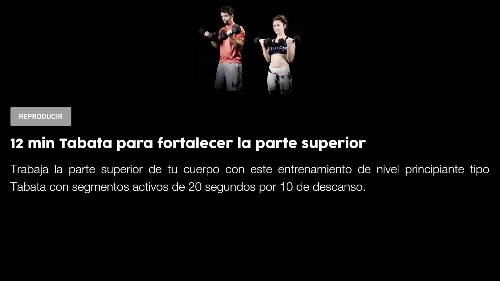
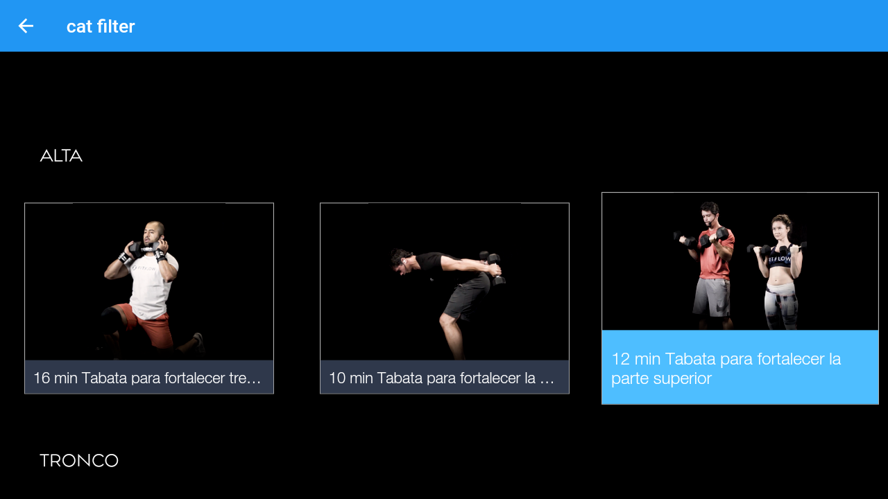
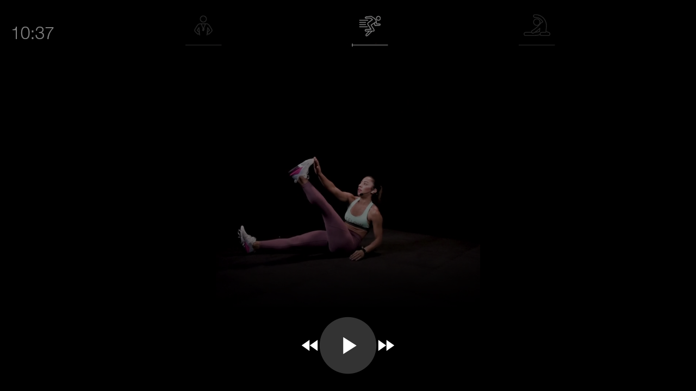
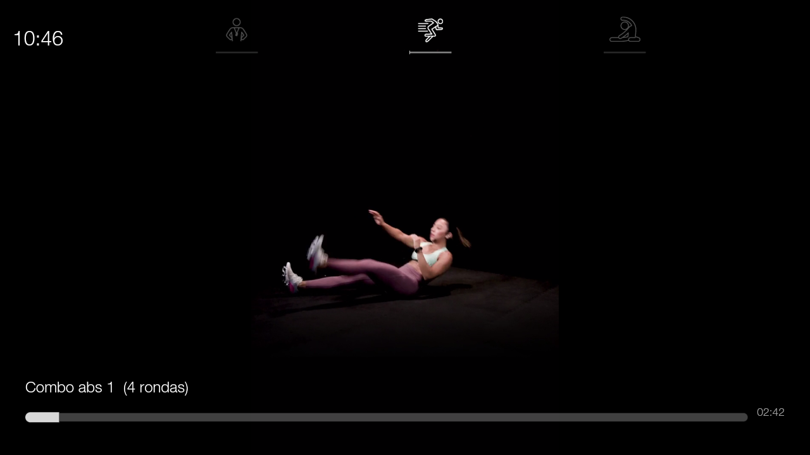

# flutter_tv

Flutter App for Android TV

## Getting Started
<h1>Home</h1>

<h1>Details</h1>

<h1>Filtered</h1>

<h1>Video</h1>

<h1>Custom Player Controls</h1>

## Plugins implemented
<ul>
	<li>video_player</li>
	<li>flutter_bloc</li>
	<li>equatable</li>
	<li>flutter svg</li>
</ul>

This project is a starting point for a Flutter application.

A few resources to get you started if this is your first Flutter project:

- [Lab: Write your first Flutter app](https://flutter.dev/docs/get-started/codelab)
- [Cookbook: Useful Flutter samples](https://flutter.dev/docs/cookbook)

For help getting started with Flutter, view our
[online documentation](https://flutter.dev/docs), which offers tutorials,
samples, guidance on mobile development, and a full API reference.
